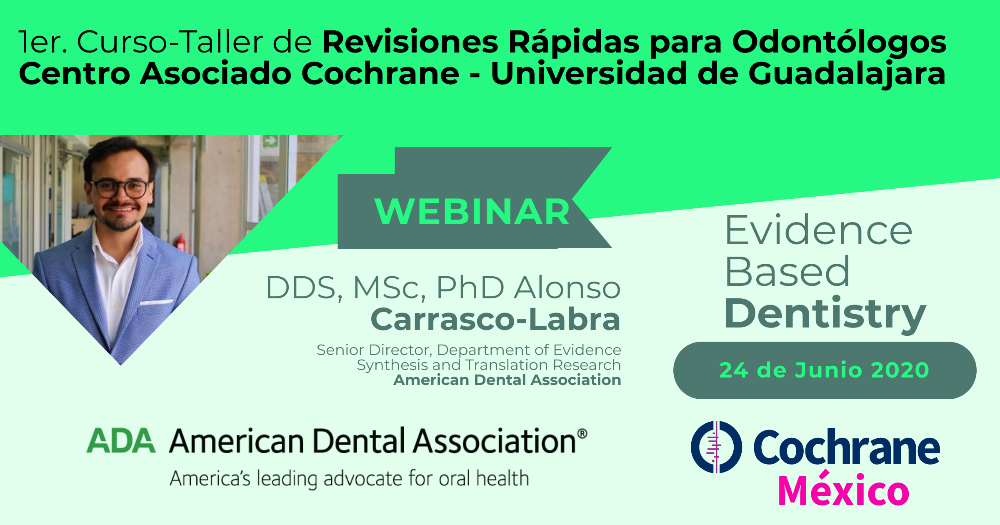

## Bienvenidos al 1er Curso-Taller a distancia de Revisiones Rápidas

] 

## Sesión 1 (19/06/2020):

Este curso es un esfuerzo realizado por la Universidad de Guadalajara, Cochrane México y la American Dental Association, dentro de los principales objetivos de este curso es el informar a los asistentes respecto a la evidencia disponible de utilidad para resolver preguntas pertinentes en el área de la odontología, las preguntas que no pudieran ser contestadas con la información ya disponible de revisiones sistemáticas y síntesis de evidencia, se ofrecerán las herramientas y el acercamiento metodológico para la búsqueda y elaboración de revisiones rápidas. 

Ligas de interés: 

[https://www.who.int/alliance-hpsr/resources/publications/rapid-review-guide/en/](https://www.who.int/alliance-hpsr/resources/publications/rapid-review-guide/en/)

[https://training.cochrane.org/resource/rapid-reviews-strengthen-health-policy-and-systems](https://training.cochrane.org/resource/rapid-reviews-strengthen-health-policy-and-systems)

[https://ebd.ada.org/en](https://ebd.ada.org/en)

[https://methods.cochrane.org/rapidreviews/welcome](https://methods.cochrane.org/rapidreviews/welcome)

[https://covidrapidreviews.cochrane.org/](https://covidrapidreviews.cochrane.org/)

[https://es.epistemonikos.cl/frisbees-mensuales/](https://es.epistemonikos.cl/frisbees-mensuales/)

[http://www.covid19reviews.org/](http://www.covid19reviews.org/)

*OBJETIVOS DE LA SESIÓN:* 
1. Identificar los elementos claves de una revisión rápida, asi como otros productos de evidencia rápida y diferenciar los métodos de una revisión sistemática, los alcances y las limitaciones de adoptar este método.  
2. Formar equipos de mínimo 9 integrantes.
3. Desarrollar competencias suaves entre los asistentes: Colaboración, comunicación, interacción interpersonal y relación con sus compañeros. 
4. Prepararse para emprender un proyecto colaborativo en el desarrollo y síntesis de la evidencia científica. 

*PRESENTACIÓN SESIÓN 1:* [Introducción a las Revisiones Rápidas](Sesión_1.pdf)

] 

## Sesión 2 (24/06/2020):

La segunda sesión del curso es un acercamiento a la utilización de la evidencia científica, se hace un recordatorio amplio respecto a los aspectos más relevantes de las revisiones sistemáticas, su metodología y su interpretación. 

Invitado: Alonso Carrasco-Labra, DDS, MsC, PhD. American Dental Association.

Ligas de interés: 

[How to Use Evidence-Based Dental Practices to Improve Clinical Decision-Making](https://www.amazon.com.mx/Evidence-Based-Practices-Improve-Clinical-Decision-Making/dp/1684470617/ref=tmm_pap_swatch_0?_encoding=UTF8&qid=1593152485&sr=8-1)

*OBJETIVOS DE LA SESIÓN:* 
1. Entender el valor de los métodos de síntesis de investigación y transferencia del conocimiento en la practica 
2. Describir los elementos que permiten la diferenciación entre una revisión sistemática de buena calidad y una de baja calidad. 
3. Interpretar los resultados de una revisión sistemática 

*PRESENTACIÓN SESIÓN 2:*

] 

## Sesión 3 (26/06/2020):

El proceso de la elaboración de una revisión sistemática debe de concretar la propuesta de un título a partir de una pregunta clínica contestable a través de una estructura PICO, considerar los elementos necesarios para registrar un protocolo y conformar un equipo de trabajo con roles establecidos, tiempo destinado al proyecto y metas puntuales. 

*OBJETIVOS DE LA SESIÓN:*
1. Proceso de escritura de una revisión sistemática con Metodología de Cochrane
2. Escritura y registro de un protocolo de investigación
3. Definiendo una pregunta de investigación

[Cochrane Handbook for Systematic Reviews of Interventions](https://training.cochrane.org/handbook/current)

*PRESENTACIÓN SESIÓN 3:*

## Sesión 4 (01/07/2020):

*OBJETIVOS DE LA SESIÓN:*
1. Métodos para la búsqueda en bases de datos
2. Construcción de estrategias de búsqueda
3. Métodos para la selección de estudios

[Guidance for Conducting Systematic Scoping Reviews, JBI 2015](https://journals.lww.com/ijebh/Fulltext/2015/09000/Guidance_for_conducting_systematic_scoping_reviews.5.aspx)

*PRESENTACIÓN SESIÓN 4:*

## Sesión 5 (03/07/2020):

## Sesión 6 (08/07/2020):
